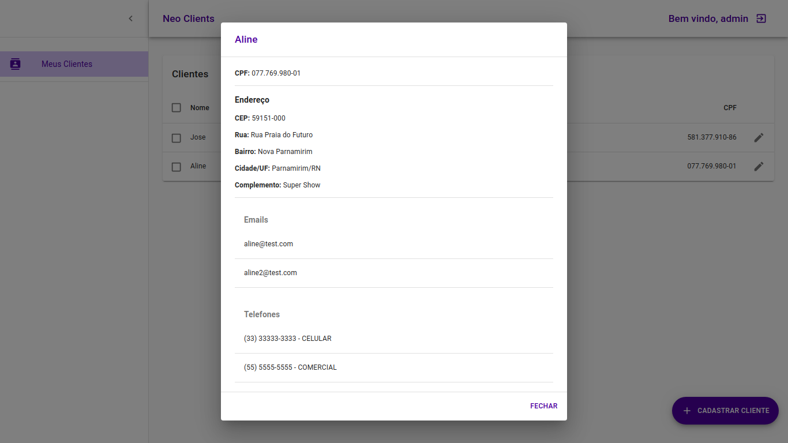
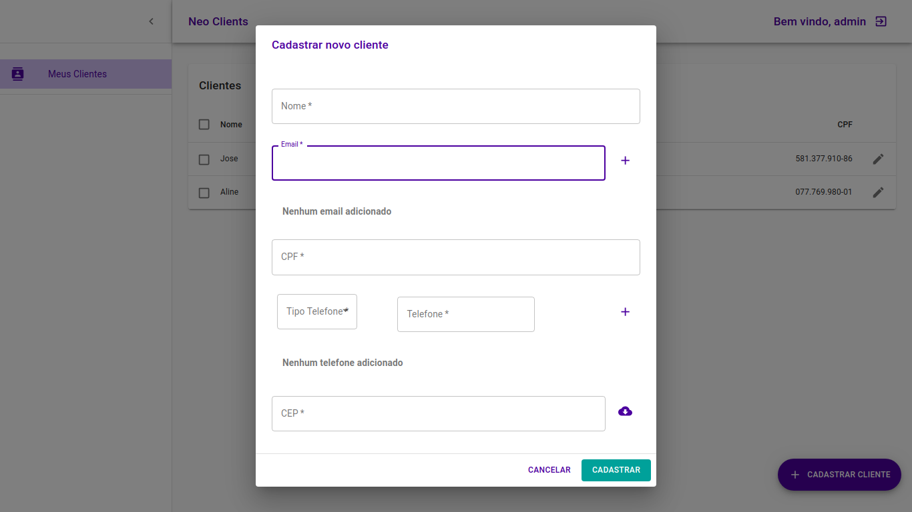
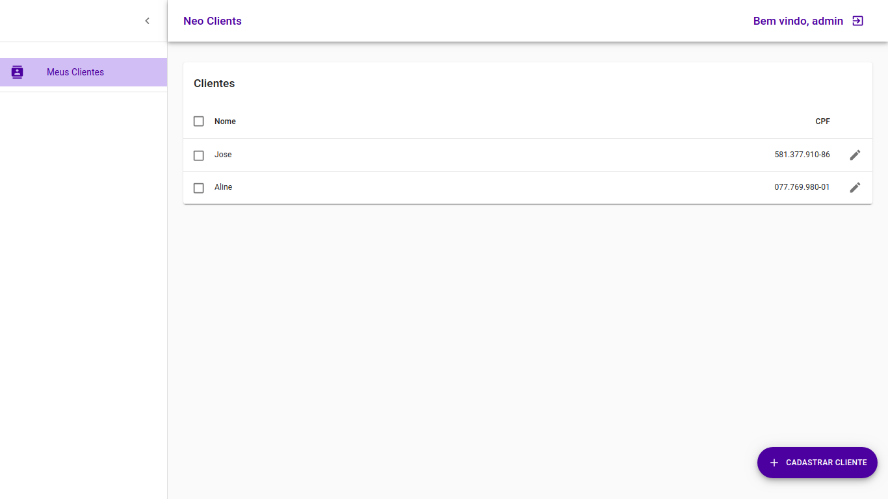

# Neo clients surittec
A simple CRUD application

Para acessar a aplicação frontend basta acessar o link:

- [Neo Clients web app](https://neo-clients-surittec-git-develop.joaogabriel55.vercel.app)

Para acessar a aplicação backend (API) basta acessar o link:

- [Neo Clients API](https://neo-clients-api.herokuapp.com/neo-clients)

## Deploy local

### Frontend

Para deploy local da app frontend basta executar os seguintes comandos:

`npm install`

Alterar no arquivo .env a URL que aponta para a API do backend service

`REACT_APP_API_BACKEND=<URL_API>`

E iniciar a aplicação

`npm run start`

### Backend

Para deploy local da app backend basta executar os seguintes comandos:

**Antes alterar o arquivo src/main/resources/application-development.properties as propriedades:**

`
spring.datasource.url={URL}
spring.datasource.username={USERNAME}
spring.datasource.password={PASSWORD}
`

**E alterar o arquivo src/main/resources/application.properties a propriedade de profile:**

`spring.profiles.active=development`

E por fim realizar o deploy via comando:

`sudo mvn spring-boot:run`

**Nota: é preciso ter o maven instalado em sua máquina**

